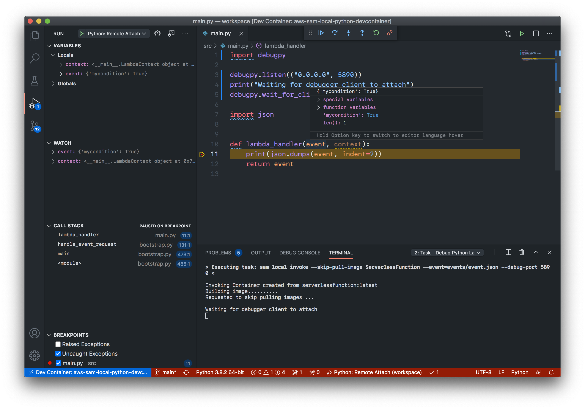

#  vscode-devcontainer-aws-sam-local

Develop and debug AWS SAM functions locally from VS Code Dev Containers



## Prerequisites

- Docker (tested on macOS, Linux, and GitHub Codespaces)
- VS Code with *Remote - Containers* extension installed

## Usage

1. Clone the repository
    ```sh
    git clone https://github.com/ilyasotkov/aws-sam-local-python-devcontainer.git
    ```
2. (Only needed on Linux or GitHub Codespaces): Modify [.devcontainer/devcontainer.json](https://github.com/ilyasotkov/aws-sam-local-python-devcontainer/blob/main/.devcontainer/devcontainer.json) by uncommenting one of the lines in `runArgs` property depending on your Docker version.

3. Open the cloned folder in VS Code. You'll be prompted to reopen in container, agree by pressing "Reopen in container".
3. Wait for container image to build and container to launch and VS Code extensions to download.
4. Go to [`./src/main.py`](https://github.com/ilyasotkov/aws-sam-local-python-devcontainer/blob/main/src/main.py). Uncomment all commented out lines (this is so that the Lambda function will wait for VS Code debugger to attach). Set a breakpoint in the `lambda_handler` function at the `print(json.dumps(event, indent=2))` line.
5. Go to the debug tab in VS Code, and press on "Start Debugging". Debugger should automatically attach and hit the breakpoint that you've set.

## Common issues

### `Configured debug type 'debugpy' is not supported.`

Happens because you `Start Debugging` while the `ms-python.debugpy` VSCode extension is still installing. Solution: wait for the extension to install, you can check the installation status in VSCode's Extensions view.

### Does not work on arm64

This repo has only been tested on x86_64 architecture. If you get it working on arm64, feel free to submit a PR!
